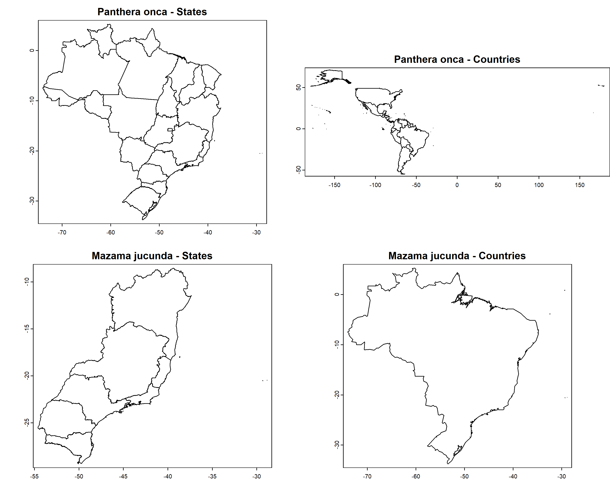

```{r, include = FALSE}
knitr::opts_chunk$set(
  collapse = TRUE,
  comment = "#>",
  warning = FALSE,
  message  = FALSE,
  eval = FALSE,
  fig.width = 8,
  fig.height = 6
)
```

## Carregando os dados
Antes de começar, utilize a função load_faunabr para carregar os dados. Para informações mais detalhadas sobre como obter e carregar os dados, consulte [Primeiros passos com faunabr](https://wevertonbio.github.io/faunabr/articles/primeiros_passos.html)

```{r}
library(faunabr)
library(terra)
#Carregar dados
bf <- load_faunabr(data_dir = my_dir, #Pasta onde foi salvo o arquivo com get_faunabr()
                   data_version = "latest", #Versão mais recente
                   type = "short") #Versão resumida
#> Loading version 1.3
```

## Obter polígonos espaciais da distribuição de espécies
Fauna do Brasil fornece informações sobre os estados brasileiros e países com ocorrências confirmadas das espécies. A função `get_spat_occ()` extrai essas informações e retorna polígonos espaciais (SpatVectors) que representam a distribuição da espécie. Podemos escolher obter o SpatVector dos estados e/ou países.

```{r}
#Espécies de exemplo
spp <- c("Panthera onca", "Mazama jucunda")
#Obter polígonos espaciais
spp_spt <- fauna_spat_occ(data = fauna_data, species = spp, state = TRUE,
                          country = TRUE, verbose = TRUE)
#> Getting states of Panthera onca
#> Getting countries of Panthera onca
#> Getting states of Mazama jucunda
#> Getting countries of Mazama jucunda
```

Os SpatVectors são armazenadas em uma lista aninhada por espécies:

```{r}
par(mfrow = c(2, 2), mar = c(2, 0, 2, 0)) 
plot(spp_spt$`Panthera onca`$states,
     main = paste0(names(spp_spt)[[1]], " - States"), mar = NA)
plot(spp_spt$`Panthera onca`$countries,
     main = paste0(names(spp_spt)[[1]], " - Countries"), mar = NA)
plot(spp_spt$`Mazama jucunda`$states,
     main = paste0(names(spp_spt)[[2]], " - States"), mar = NA)
plot(spp_spt$`Mazama jucunda`$countries,
     main = paste0(names(spp_spt)[[2]], " - Countries"), mar = NA)
```

```{r IMG01, eval=TRUE, echo=FALSE}

```

## Filtrando registros de ocorrência usando informações de distribuição no Fauna do Brasil

Erros de georreferenciamento em registros de espécies online podem introduzir vieses significativos nos resultados de pesquisas ecológicas e biogeográficas. Alguns pacotes R, como o [CoordinateCleaner](https://besjournals.onlinelibrary.wiley.com/doi/10.1111/2041-210X.13152), ajudam a identificar erros comuns em dados de coleções biológicas, como registros de organismos terrestres que caem no mar ou que foram atribuídos a centroides de capitais e estados.
Dado que as distribuições de espécies no Fauna do Brasil são baseadas na expertise de taxonomistas, elas representam informações valiosas para adicionar um passo adicional na verificação da validade de registros de ocorrência obtidos de bancos de dados online (como GBIF ou SpeciesLink).
A função `filter_faunabr()` automatiza essa identificação. Você pode usar a função para sinalizar e/ou remover registros que estejam fora dos estados brasileiros ou países com ocorrências confirmadas de acordo com a Fauna do Brasil.

Como exemplo, vamos usar os registros de ocorrência de duas espécies. *Panthera onca* é um felino terrestre com ocorrências confirmadas em 22 dos 27 estados brasileiros (ausente no Rio Grande do Norte, Paraíba, Pernambuco, Alagoas e Sergipe) e em 20 países.
*Chaetomys subspinosus* é um roedor arbóreo endêmico do Brasil com ocorrências confirmadas em 5 estados (Bahia, Espírito Santo, Minas Gerais, Rio de Janeiro e Sergipe). Vamos plotar mapas com essas informações usando a função `get_spat_occ()`:

```{r}
my_spp <- c("Panthera onca", "Chaetomys subspinosus")
pol_spp <- fauna_spat_occ(data = bf, species = my_spp,
                       state = TRUE, country = TRUE, 
                       verbose = TRUE)
par(mfrow = c(2, 2), mar = c(2, 0, 2, 0))
plot(pol_spp$`Panthera onca`$states,
     main = paste0(names(pol_spp)[[1]], " - States"), mar = NA)
plot(pol_spp$`Panthera onca`$countries,
     main = paste0(names(pol_spp)[[1]], " - Countries"), mar = NA)
plot(pol_spp$`Chaetomys subspinosus`$states,
     main = paste0(names(pol_spp)[[2]], " - States"), mar = NA)
plot(pol_spp$`Chaetomys subspinosus`$countries,
     main = paste0(names(pol_spp)[[2]], " - Countries"), mar = NA)
```
```{r IMG02, eval=TRUE, echo = FALSE}

```
As ocorrências dessas duas espécies foram baixadas do GBIF usando a função `plantR::rgbif2()`. Essas ocorrências estão salvas como exemplos de dados no pacote (para mais detalhes, veja `?faunabr::occurrences`). Podemos importá-las com:

```{r}
data("occurrences")
head(occurrences)
#>         species         x          y
#> 1 Panthera onca -90.38409  17.377023
#> 2 Panthera onca -90.24368  17.240507
#> 3 Panthera onca -77.36680   0.287624
#> 4 Panthera onca -56.61023 -17.239688
#> 5 Panthera onca -61.04386  -2.387029
#> 6 Panthera onca -77.28850   0.288757
```

Os dados de entrada com registros devem ser um dataframe com pelo menos 3 colunas: uma informando o nome da espécie, uma informando a longitude e outra informando a latitude.
Vamos verificar se há registros fora das áreas naturais de ocorrência das espécies considerando estados e países:

```{r}
occ_check <- filter_faunabr(data = df, occ = occurrences,
                    by_state = TRUE, buffer_state = 20,
                    by_country = TRUE, buffer_country = 20,
                    value = "flag&clean", keep_columns = TRUE,
                    verbose = FALSE)
#> Returning list with flagged and cleaned occurrences
```

Como configuramos *value = "flag&clean"*, a função retornou uma lista com dois dataframes: um com todos os registros sinalizados se passaram (TRUE) ou não (FALSE) em cada teste; e outro apenas com os registros que passaram em todos os testes.

Vamos usar o pacote [mapview](https://r-spatial.github.io/mapview/) para plotar um mapa interativo dos registros sinalizados:

```{r, warning=FALSE, results='hide'}
#Instala pacote (se necessário)
if(!require(mapview)){
    install.packages("mapview")
}
#Carregar pacote
library(mapview)
```

Vamos verificar os registros de *Panthera onca*, plotando os registros e o mapa obtido anteriormente. Os pontos verdes representam os registros que passaram no teste dos estados, ou seja, registros dentro dos estados com ocorrência confirmada da espécie. Os pontos vermelhos são os registros que caem fora dos estados. Os pontos cinzas são registros que não foram testados porque estão fora do Brasil.

```{r, fig.width= 9}
#Converter pontos para spatvector
panthera_occ <- subset(occ_check$flagged,
                       occ_check$flagged$species == "Panthera onca")
panthera_occ <- vect(panthera_occ, geom = c("x", "y"),
                     crs = crs(pol_spp$`Panthera onca`$states))

#Plot interativo
mapview(pol_spp$`Panthera onca`$states,
        layer.name = "States with confirmed occurrences") +
  mapview(panthera_occ, zcol = "inside_state", layer.name = "Inside state?",
          col.regions = c("red", "green"))
```
```{r IMG03, eval=TRUE, echo = FALSE, fig.pos="H", out.width="90%"}
knitr::include_graphics("vignettes_img/IMG03.png")
```
Podemos observar o mesmo com os países: os pontos verdes representam registros que passaram no teste e os pontos vermelhos representam registros que não passaram no teste.

```{r, fig.width= 9}
#Plot interativo
mapview(pol_spp$`Panthera onca`$countries,
        layer.name = "Countries with confirmed occurrences", burst = TRUE, legend = F) +
  mapview(panthera_occ, zcol = "inside_country",
          col.regions = c("red", "green"),
          layer.name = "Inside country?")
```
```{r IMG04, eval=TRUE, echo = FALSE, fig.pos="H", out.width="90%"}

```
