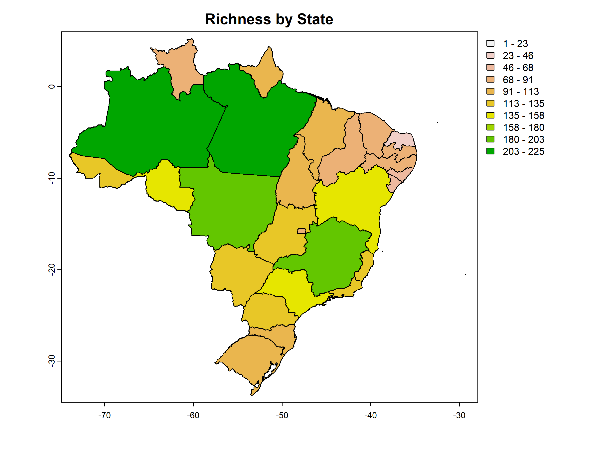

  
```{r, include = FALSE}
knitr::opts_chunk$set(
  collapse = TRUE,
  comment = "#>",
  warning = FALSE,
  message  = FALSE,
  eval = FALSE,
  fig.width = 8,
  fig.height = 6
)
```

One way of organizing biodiversity data is by using presence-absence matrices (PAMs), where a one represents the presence of species j in cell i, and a zero indicates absence. From a PAM, we can estimate a variety of metrics related to biodiversity patterns, including richness, range size, and composition. For a comprehensive list of biodiversity metrics, refer to the [PAM_indices function in the biosurvey package](https://claununez.github.io/biosurvey/reference/PAM_indices.html).

## Loading data
Before you begin, use the `load_faunabr` function to load the data. For more detailed information on obtaining and loading the data, please refer to [1. Getting started with faunabr](getting_started.html)

```{r Get data, results='hide', message=FALSE, warning=FALSE, echo=FALSE}
my_dir <- file.path(file.path(tempdir(), "faunabr"))
dir.create(my_dir)
get_faunabr(output_dir = my_dir, #directory to save the data
            data_version = "latest", #get the most recent version available
            overwrite = T) #Overwrite data, if it exists
```

```{r, message=FALSE, warning=F}
library(faunabr)
library(terra)
#Folder where you stored the data with the function get_faunabr()
#Load data
bf <- load_faunabr(data_dir = my_dir,
                   data_version = "latest",
                   type = "short") #short version
#> Loading version 1.3
```

## Getting a presence-absence matrix

The `fauna_pam()` function facilitates the utilization of species distribution information in Fauna do Brazil to generate a PAM. Each site represents a brazilian state or a country. In addition to the PAM, the function also provides a summary and a SpatVector containing the number of species in each site.

As an example, lets obtain a PAM consisting of all mammal species natives to Brazil:

```{r}
#Select native species of mammals with confirmed occurrence in Brazil
br_mammals <- select_fauna(data = bf,
                           include_subspecies = FALSE, phylum = "all",
                           class = "Mammalia",
                           order = "all", family = "all",
                           genus = "all",
                           lifeForm = "all", filter_lifeForm = "in",
                           habitat = "all", filter_habitat = "in",
                           states = "all", filter_states = "in",
                           country = "BR", filter_country = "in",
                           origin = "all", taxonomicStatus = "accepted")

#Get presence-absence matrix in states and countries
pam_mammals <- fauna_pam(data = br_mammals, by_state = TRUE,
                         by_country = FALSE,
                         remove_empty_sites = TRUE,
                         return_richness_summary = TRUE,
                         return_spatial_richness = TRUE,
                         return_plot = TRUE)

#Visualize (as tibble) the PAM for the first 5 species and 7 sites
tibble::tibble(pam_mammals$PAM[1:7, 1:5])
#> # A tibble: 7 × 5
#>   states `Platyrrhinus aurarius` `Kannabateomys amblyonyx` `Callicebus lucifer` `Cerradomys maracajuensis`
#>   <fct>                    <dbl>                     <dbl>                <dbl>                      <dbl>
#> 1 AM                           1                         0                    1                          0
#> 2 ES                           0                         1                    0                          0
#> 3 MG                           0                         1                    0                          1
#> 4 PR                           0                         1                    0                          0
#> 5 RJ                           0                         1                    0                          0
#> 6 RS                           0                         1                    0                          0
#> 7 SC                           0                         1                    0                          0
```
Since return_richness_summary is set to TRUE, the function also returns a data frame containing the number of species per site.

```{r}
#Visualize (as tibble) the richness summary table
tibble::tibble(pam_mammals$Richness_summary[1:7,])
#> # A tibble: 7 × 3
#> states   richness
#>   <fct>     <dbl>
#> 1 AM          225
#> 2 ES          120
#> 3 MG          188
#> 4 PR          116
#> 5 RJ          133
#> 6 RS          105
#> 7 SC          101
```

If return_spatial_richness is set to TRUE, the function will return a SpatVector containing the number of species per site. Additionally, when return_plot is also set to TRUE, the function returns a plot.

```{r IMG09, eval=TRUE, echo = FALSE}

```
