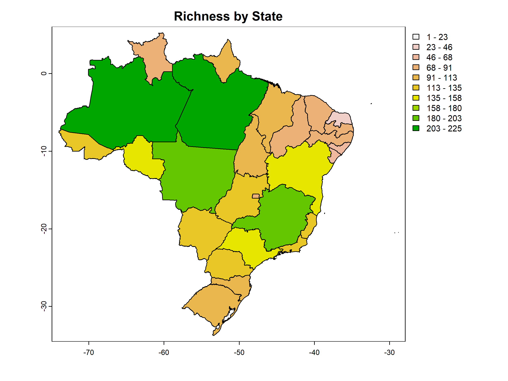

```{r, include = FALSE}
knitr::opts_chunk$set(
  collapse = TRUE,
  comment = "#>",
  warning = FALSE,
  message  = FALSE,
  eval = FALSE,
  fig.width = 8,
  fig.height = 6
)
```

Uma forma de organizar dados de biodiversidade é usando matrizes de presença-ausência (PAMs), onde 1 representa a presença da espécie j na célula i, e 0 indica ausência. A partir de uma PAM, podemos estimar uma variedade de métricas relacionadas a padrões de biodiversidade, incluindo riqueza, tamanho da área de distribuição e composição. Para uma lista abrangente de métricas de biodiversidade, consulte a função [PAM_indices do pacote biosurvey](https://claununez.github.io/biosurvey/reference/PAM_indices.html).

## Carregando os dados
Antes de começar, utilize a função `load_faunabr()` para carregar os dados. Para informações mais detalhadas sobre como obter e carregar os dados, consulte [Primeiros passos com faunabr](https://wevertonbio.github.io/faunabr/articles/primeiros_passos.html)

```{r}
library(faunabr)
#Carregar dados
bf <- load_faunabr(data_dir = my_dir, #Pasta onde foi salvo o arquivo com get_faunabr()
                   data_version = "Latest_available", #Versão mais recente
                   type = "short") #Versão resumida
#> Loading version 1.17
```

## Obtendo uma matriz de presença-ausência

A função `fauna_pam()` facilita a utilização das informações de distribuição de espécies no Fauna do Brasil para gerar uma PAM. Cada local representa um estado brasileiro ou um país. Além da PAM, a função também fornece um resumo e um SpatVector contendo o número de espécies em cada local.

Como exemplo, vamos obter uma PAM com todas as espécies de mamíferos nativos do Brasil:
```{r}
#Selecionar espécies de mamíferos nativos do Brasil:
br_mammals <- select_fauna(data = fauna_data,
                           include_subspecies = FALSE, phylum = "all",
                           class = "Mammalia",
                           order = "all", family = "all",
                           genus = "all",
                           lifeForm = "all", filter_lifeForm = "in",
                           habitat = "all", filter_habitat = "in",
                           states = "all", filter_states = "in",
                           country = "brazil", filter_country = "in",
                           origin = "all", taxonomicStatus = "accepted")
#PAM em Estados e Países
pam_mammals <- fauna_pam(data = br_mammals, by_state = TRUE, by_country = TRUE,
                         remove_empty_sites = TRUE,
                         return_richness_summary = TRUE,
                         return_spatial_richness = TRUE,
                         return_plot = TRUE)
#Visualizar (em tibble) PAM com as primeiras 5 espécies nos primeiros 5 sites
tibble::tibble(pam_mammals$PAM[1:7, 1:5])
#> # A tibble: 7 × 5
#>   countryCode states `Stenella frontalis` `Alouatta ululata` `Platyrrhinus aurarius`
#>   <fct>       <fct>                 <dbl>              <dbl>                   <dbl>
#> 1 brazil      AM                        1                  1                       1
#> 2 guyana      NA                        1                  1                       1
#> 3 suriname    NA                        1                  1                       1
#> 4 venezuela   NA                        1                  1                       1
#> 5 argentina   NA                        1                  1                       0
#> 6 paraguay    NA                        1                  1                       0
#> 7 colombia    NA                        1                  1                       0
```
Como *return_richness_summary* está definido como *TRUE*, a função também retorna um dataframe contendo o número de espécies por local.
```{r}
#Visualise (em tibble) a tabela com a riqueza por site
tibble::tibble(pam_mammals$Richness_summary[1:7,])
#> # A tibble: 7 × 3
#>   countryCode states richness
#>   <fct>       <fct>     <dbl>
#> 1 brazil      AM          775
#> 2 guyana      NA          336
#> 3 suriname    NA          328
#> 4 venezuela   NA          342
#> 5 argentina   NA          331
#> 6 paraguay    NA          332
#> 7 colombia    NA          343
```

Se *return_spatial_richness* estiver definido como *TRUE*, a função retornará um SpatVector contendo o número de espécies por local. Além disso, quando *return_plot* também estiver definido como *TRUE* a função retornará um plot do mapa:
```{r IMG09, eval=TRUE, echo = FALSE}

```

